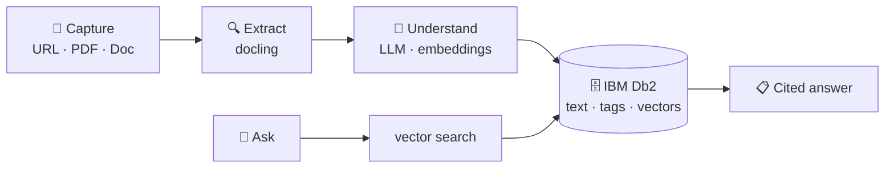

# second-brain-with-db2

> **Status:** work in progress. New stages land as I build them.

I'm building a second brain on IBM Db2. It's a real app, not a demo. I'm the first user.

Built in public, one stage at a time. Read the code, run any version, watch the next one land.

## Vision

Most "second brain" tools are products you subscribe to. You feed them your articles, notes, and PDFs, and trust a black box to organize and surface what matters.

I'd rather build my own. The database underneath isn't a hidden vector store. It's IBM Db2, the same engine that runs banks and airlines, here powering a personal AI app you can read end to end.

A personal tool that's educational because it's built in public.

## Who this is for

If you're an engineer preparing for a career in AI, you don't need another finished tutorial. You need to see someone build, stumble, refactor, and ship.

That's what this is. The lessons apply beyond Db2.

## How I'm building it

→ One feature at a time.
→ Minimalist before robust. Functionality first.
→ Every stage lives in its own folder. Run any version, read the code, move to the next.
→ AI coding agents allowed, with guardrails. No skipping the thinking.

## The use case

I read a lot for work. Articles, papers, conference talks, PDFs, docs. Most of it ends up "saved" somewhere I never look again.

What I want instead is a place where my reading lives, gets understood, and stays useful:

- **Capture from anywhere.** Paste a URL. Upload a PDF. Drop in a document. The app fetches the content, extracts the meaningful text (no ads, no navigation chrome), and stores it.
- **Understand on arrival.** Each item is summarized and tagged automatically by an LLM, so a 40-page paper or a long-read article gives me its argument in five sentences without me re-reading it.
- **Categorize and connect.** Across everything I've collected, the app finds themes: what topics are recurring, what sources are converging on the same ideas, what's actually fresh versus rehashed.
- **Search by meaning, not keywords.** Vector search over the full text means I can ask *"what did anyone say about hybrid retrieval in production?"* and get answers from a six-month-old blog post and a paper from last week, with citations.
- **Synthesize on demand.** Ask the second brain a real question and it answers using only the material I've collected. Grounded in my own curated reading, not the open internet.

Db2 is the foundation throughout. Text, metadata, vector embeddings, tags, relationships, all stored and queried in Db2. The same SQL that runs the world's enterprise data also runs my second brain.

## How the repository is organized

Each stage lives in its own folder under [stages/](stages/). Self-contained, runnable, adds one capability over the previous. Start at [00-basic](stages/00-basic/) and walk forward.

Stage-by-stage notes will appear here as more stages land.

## Follow along

I'm posting the build in public on LinkedIn: `<your-linkedin-url-here>`

Longer write-ups, lessons, and the occasional dead end go there. Code lives here.

## License

Apache 2.0. See [LICENSE](LICENSE).
