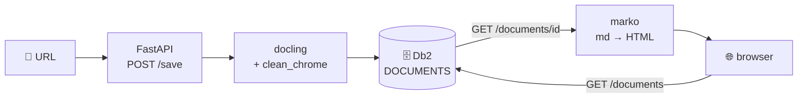

# Stage 1: store documents in Db2

Replaces the filesystem write from stage 0 with an INSERT into a Db2 `DOCUMENTS` table. Each save creates a new row with the URL, a timestamp, the article title, and the markdown as a `CLOB`. Adds browse + rendered-view pages.



## What's new vs stage 0

- **Schema** ([schema.sql](schema.sql)): `DOCUMENTS(ID, URL, TITLE, SAVED_AT, CONTENT CLOB(10M))` with an identity PK. **The table is dropped and recreated on every launch** (`DROP TABLE IF EXISTS` → `CREATE TABLE`) — saved documents do not survive a re-run.
- **Driver:** adds `ibm_db` (official IBM Db2 Python driver) to requirements.
- **Connection:** one long-lived `ibm_db.connect(...)` at module load, same pattern as `DocumentConverter`.
- **Save flow:** `converter.convert(url).document.export_to_markdown()` → `INSERT INTO DOCUMENTS` → return the new identity column value as `id`.
- **No filesystem writes.** Existing markdown files from stage 0 in `~/second-brain/` are left untouched.
- **Browse pages:** `GET /documents` lists saved docs (newest first), `GET /documents/{id}` renders the markdown as HTML via `marko`. Light inline CSS for readable typography.
- **Title extraction:** during save, the last item labeled `DocItemLabel.TITLE` from the parsed `DoclingDocument` is stored in a nullable `TITLE` column. The list page shows `COALESCE(TITLE, URL)` as the link text, so documents without a recognizable title fall back to their URL.
- **Chrome cleanup:** `clean_chrome()` filters universal UI labels (`Subscribe`, `Sign in`, `Share`, `Comments`, `'s avatar`, copyright lines, bare digit counts, email-signup placeholders) from the markdown before storing. Platform-specific chrome (e.g., `Restacks`, `Top`/`Latest` tabs) is intentionally not filtered to keep the rules general.
- **Text only:** images are deliberately excluded from `CONTENT_LABELS` (along with `PAGE_HEADER` and `PAGE_FOOTER`). The saved markdown is article text only, no figures or `<!-- image -->` placeholders.
- **Faster startup:** the PDF pipeline runs with `do_ocr=False`. Skips loading RapidOCR models at boot. Scanned/image-only PDFs will produce empty text; text-layer PDFs and HTML are unaffected.

Assumes you're running as the Db2 instance owner (`db2inst1`) against the locally cataloged `SAMPLE` database. Edit the `ibm_db.connect(...)` line in `app.py` if your setup differs.

## Run

From the project root (with `.venv` created):

```bash
./stages/01-db2/run.sh
```

The script installs deps, runs `schema.sql` against the target database (**this wipes the `DOCUMENTS` table**), then launches the app on http://127.0.0.1:8000.

## Inspect saved documents

```bash
db2 connect to sample
db2 "SELECT ID, TITLE, URL, SAVED_AT, LENGTH(CONTENT) AS BYTES FROM DOCUMENTS ORDER BY ID DESC"
db2 "SELECT SUBSTR(CONTENT, 1, 500) FROM DOCUMENTS WHERE ID = 1"
db2 terminate
```
